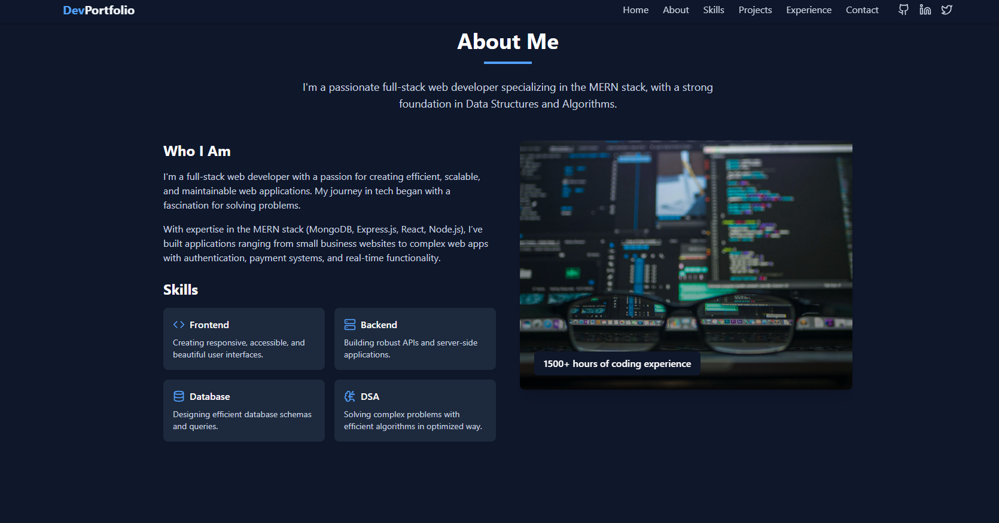

# 🧑‍💻 My-Portfolio

A modern, responsive portfolio website built to showcase my projects, skills, and experience as a developer.

## 🚀 About the Project

In today’s competitive tech industry, a portfolio is more than just a resume — it's a personal brand. This portfolio site is designed to represent my technical skills, highlight key projects, and provide an easy way for potential employers, clients, and collaborators to get to know me better.

## ✨ Features

- 📁 Project showcase with descriptions and links
- 🛠️ Skills section for highlighting technologies used
- 👤 About section to introduce myself
- 📱 Fully responsive layout for all devices
- 🌙 Dark mode and Light mode featured
- 📬 Contact form for direct communication

## 🛠️ Tech Stack

- **Frontend**:  React + Vite 
- **Styling**: Tailwind CSS
- **Icons**: Lucide React 

## 📷 Screenshots



## 🧩 Getting Started

### Clone the repo

```bash
git clone https://github.com/meerathaakur/My-Portfolio.git
cd My-Portfolio

npm install
npm run dev